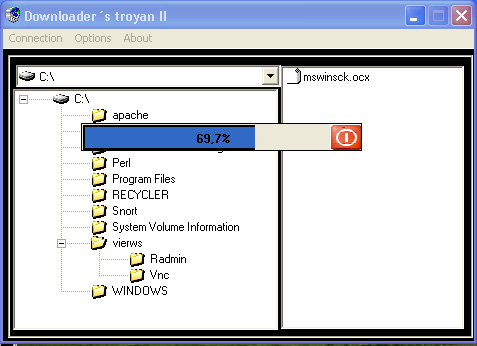



## trojan's uploader

### Description

Creates a Server which,

when run, allows a user to upload any

kind of files to the computer running

the server with abilities to also

execute the uploaded file. There is

also a basic Edit Server package

included where you are able to define

msgbox error when run and also Email

notification when Server is online.

There's also a Remove tool.The server compressed occupies 17 kb and it does not use mswinsck.ocx, the  winsock API ' s utilizes
 
### More Info
 

             |
---                |---
**Submitted On**   |2003-09-04 15:02:20
**By**             |[Manuel\(ErcUn\)](https://github.com/Planet-Source-Code/PSCIndex/blob/master/ByAuthor/manuel-ercun.md)
**Level**          |Intermediate
**User Rating**    |5.0 (10 globes from 2 users)
**Compatibility**  |VB 5\.0, VB 6\.0
**Category**       |[Complete Applications](https://github.com/Planet-Source-Code/PSCIndex/blob/master/ByCategory/complete-applications__1-27.md)
**World**          |[Visual Basic](https://github.com/Planet-Source-Code/PSCIndex/blob/master/ByWorld/visual-basic.md)
**Archive File**   |[trojan's\_u164110942003\.zip](https://github.com/Planet-Source-Code/manuel-ercun-trojan-s-uploader__1-48262/archive/master.zip)

